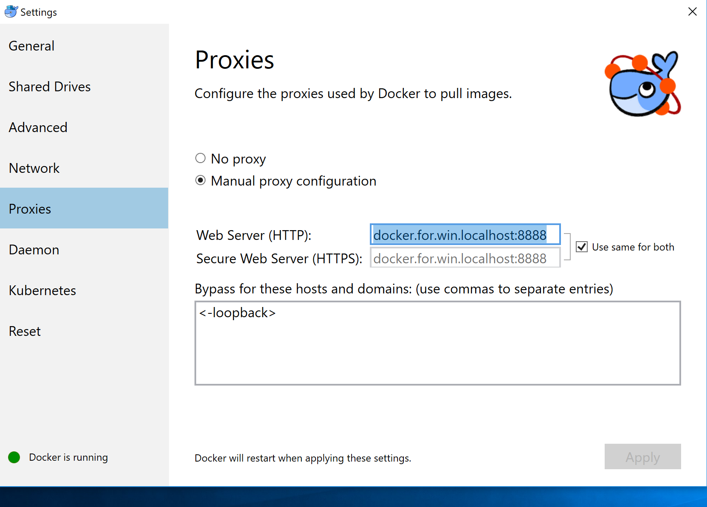

# Hello Proxy users
We will show how to use a proxy for docker, how to use a proxy throughout this guide and give links to great proxy user articles.

## Docker proxy for push/pull

To setup docker proxies for docker pull and docker push, you will follow different steps for the different versions of docker.
###### Windows/mac
Use the UI. Navigate to Docker Settings in Windows (Preferences in Mac) and fill in the proxy section with your manual proxy configuration like so:

For more information on setting proxies in Docker for Windows see [Setting Docker Proxies for Windows](https://mandie.net/2017/12/10/docker-for-windows-behind-a-corporate-web-proxy-tips-and-tricks/)

###### Linux
Make a docker.service.d file and restart docker as below:

`mkdir -p /etc/systemd/system/docker.service.d` 
`cat > /etc/systemd/system/docker.service.d/http-proxy.conf << EOF` 
`[Service]` 
`Environment="HTTP_PROXY=http://myproxy:8080"` 
`Environment="HTTPS_PROXY=http://myproxy:8080"` 
`Environment="NO_PROXY=127.0.0.1,localhost` 
`EOF` 

`systemctl daemon-reload`

`systemctl restart docker`

[This article goes into detail on how to do this](https://elegantinfrastructure.com/docker/ultimate-guide-to-docker-http-proxy-configuration/)
## Setup your terminal/command prompt for Proxy

If using a proxy, declare your environment variables to reference in commands. Here is an example with a proxy of http://myproxy:8080 and no proxy of localhost and 127.0.0.1.

#### PSA: Proxy must have either http:// or https:// at the beginning to be used. Otherwise it will be ignored.

###### MAC/Linux

 `http_proxy=http://myproxy:8080`

 `https_proxy=http://myproxy:8080`

 `no_proxy="localhost, 127.0.0.1"`

###### Windows Command Prompt

  `set http_proxy=http://myproxy:8080`

  `set https_proxy=http://myproxy:8080`

  `set no_proxy=localhost, 127.0.0.1`

###### Windows PowerShell

  `$http_proxy = "http://myproxy:8080"` 
  `$https_proxy = "http://myproxy:8080"` 
  `$no_proxy = "localhost, 127.0.0.1"`

## Building Docker images behind Proxy
There are two main options for building docker images behind a proxy so that
your build can do things like use apt-get to install packages for the image, wget or curl
to download files or downloading a git repository during the install itself.

1. Use environment variables in your Dockerfile. 
  `ENV http_proxy http://docker.for.win.localhost:8888`  
  `ENV https_proxy http://docker.for.win.localhost:8888` 
  `ENV no_proxy localhost, 127.0.0.1` 
    This means that your settings persist to the docker image itself.
    This is in many cases not what you want because this means your users by default
 will have your proxy settings. If you are using an image internally only then this
automatically lets you run the image. However, if you are giving an image to someone
who will use it outside of your proxy environment please use the next option for
setting proxy so they don't have to worry about the app not working
and then having to change the settings themselves when running the docker container.
 

2. Use build args  
Build args allow you to provide variables for use during building an image. When the container
itself gets used these build args are not present in the container environment.
This allows us to build an image using our proxy to do our apt-get installs and curls and
then remove this variable so that the user can use their own web environment
(proxy or no proxy) instead of by default trying to contact our proxy which they
won't be able to reach.
Here is an example:

 `docker build -t href --build-arg http_proxy=http://docker.for.win.localhost:8888 --build-arg https_proxy=http://docker.for.win.localhost:8888 --build-arg no_proxy=localhost .` 

 Using our environment variables defined previously this becomes

 **BASH (Mac/Linux)**

 `docker build -t href --build-arg http_proxy=$http_proxy --build-arg https_proxy=$https_proxy --build-arg no_proxy="$no_proxy" .` 

 **Windows (Command Prompt)**

`docker build -t href --build-arg http_proxy=%http_proxy% --build-arg https_proxy=%https_proxy% --build-arg no_proxy="%no_proxy%" .` 
Now, our proxy environment variables don't show up to the end user. 
3. What about if I have confidential information such as a username/password in my proxy?  
If you have this info in your proxy environment variables users will be able to see it
in the running container's environment as well as by inspecting the container. If you used build args the
user will be able to see it by inspecting the container with `docker inspect` as well.
So what do we do. Well, we can use multi-stage builds which I go over in [3-Best-Practice-go](3-Best-Practice-go.md)
of this guide to accomplish the task since our final container will only have copies of the files built
using the proxy in a previous container. To see how to actually do this look at [Accessing Private Repository](https://vsupalov.com/build-docker-image-clone-private-repo-ssh-key/).
You can follow the steps outlined in the article for your proxy with username/password declaration for security.

## Running Docker containers behind a proxy
Some docker container don't reach out to the outside world, so they don't need to worry
about using a proxy. However, a lot of docker containers need to reach out to do things
such as checking information or sending notifications to websites. In order to do so behind a
proxy the docker container needs the correct environment variables set. The way to do that is when running the container
use -e with the proxy variables:

**BASH (Mac/Linux)**

`docker run --rm -e http_proxy=$http_proxy -e https_proxy=$https_proxy -e no_proxy="$no_proxy" mplatform/mquery gmoney23/outyet`

**Windows (Command Prompt)**

`docker run --rm -e http_proxy=%http_proxy% -e https_proxy=%https_proxy% -e no_proxy="%no_proxy%" mplatform/mquery gmoney23/outyet`

This passes the environment variables to the docker container.

##### To use a proxy with Kubernetes see [5-Deploy-to-Kubernetes](5-Deploy-to-Kubernetes.md)

#### Reference
If you still have docker proxy needs see this article [Docker Behind a Corporate Firewall](https://elegantinfrastructure.com/docker/ultimate-guide-to-docker-http-proxy-configuration/)

## Onwards

##### [1 - Official Docker Repos and Multi-Arch Primer](1-Official-Multiarch.md)
