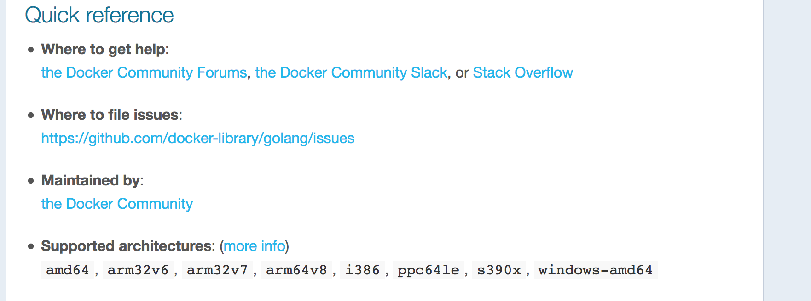

# 1. Getting Official with Multi-arch Images

This section goes through the official Docker repositories for building images and what multi-architecture images are and how to spot them.

!!! caution "If Using Proxy"
    **If using proxy**, make sure you've read [0-ProxyPSA](0-ProxyPSA.md) and have set your `http_proxy`, `https_proxy`, and `no_proxy` variables for your environment as specified there. Also note that for all docker run commands add the `-e` for each of the proxy environment variables as specified in that [0-ProxyPSA](0-ProxyPSA.md) document.

## Official Repositories
[Docker Official Images](https://docs.docker.com/docker-hub/official_images/){target=_blank} are a special set of Docker repositories on DockerHub that host images for operating systems and base software that follow Dockerfile best practices and undergo regular security scans to allow them to serve as building blocks for your applications. These repositories are where you get the images to build your applications on top of.

[Check out the Docker Official Images here](https://hub.docker.com/search?q=&type=image&image_filter=official){target=_blank}

We will specifically be looking at building Node.js and Go applications, so we will use the [Node.js Official Docker Image](https://hub.docker.com/_/node/){target=_blank} and the [Golang Official Docker Image](https://hub.docker.com/_/golang/){target=_blank} repositories. These images are multi-arch which means they support multiple architectures. All official images are [multi-arch](https://blog.docker.com/2017/09/docker-official-images-now-multi-platform/){target=_blank}.

!!! question "How do we know if these images support both s390x and x86?"
    If we look at the supported architectures under the `Quick reference` section on Docker Hub, we can see both images support both the x86 [amd64] and LinuxONE/z [s390x] architectures. :)

!!! tip
    If not otherwise noted in documentation, containers are assumed to use Linux as the operating system.


**This means that if I run `docker pull node` on linux on Z, it will pull me the s390x image. Similarly, if I run `docker pull node` on x86, it will pull me the x86 image.** Thus, once the image is built and set up as multi-arch, the difference is abstracted away from applications using the image (such as a node application built using the Node.js official image as the base) **[i.e. `FROM node` works on both x86 and s390x].**

## How do Multi-Arch Images Work?
A Multi-Arch image consists of a [manifest list](https://github.com/docker/distribution/blob/master/docs/spec/manifest-v2-2.md#manifest-list){target=_blank}. This manifest list links its image (i.e. each Node.js image on the [Node.js Official Docker Repository](https://hub.docker.com/_/node/){target=_blank}) to the image manifests of the docker images for the different architectures at [s390x node image](https://hub.docker.com/r/s390x/node/){target=_blank}, [amd64 node image](https://hub.docker.com/r/amd64/node/){target=_blank}, etc. This is how the magic happens, so instead of having to call the image for each architecture, I can just `docker pull node` and it gives me the correct architecture image. Nevertheless, there are official repositories that hold the official images for each architecture. This is where you can find the specific images linked to in the official image as in the example above.

For IBM Z, we have:
[Official s390x images](https://hub.docker.com/u/s390x/){target=_blank}
such as the [s390x node](https://hub.docker.com/r/s390x/node/){target=_blank} and [s390x golang](https://hub.docker.com/r/s390x/golang/){target=_blank} images.

For x86, we have official [amd64 images](https://hub.docker.com/u/amd64/){target=_blank} such as the [amd64 node](https://hub.docker.com/r/amd64/node/){target=_blank} and [amd64 golang](https://hub.docker.com/r/amd64/golang/){target=_blank} images

Other architectures such as [Power](https://hub.docker.com/u/ppc64le/){target=_blank} and [arm32](https://hub.docker.com/u/arm32v7/){target=_blank} have their own repositories as well.

## Checking Image Architecture
Many times you will want to find out if an image supports your architecture. If it doesn't and you try to run it, you can get a nasty little error.

!!! error
    ``` bash
    standard_init_linux.go:185: exec user process caused "exec format error"
    ```

This stops your container from working. In hopes to avoid that trouble once we've already spent the time to pull the image and try to run it, here are the best ways to check images for their architecture.

### I. If the image exists on your system use docker inspect.

Assume I ran previosly:

```
docker pull busybox
```

Now, I can run:

```
docker inspect -f '{{.Architecture}}' busybox
```


!!! question "But what if the image isn't on your system?"

    ```
    docker inspect -f '{{.Architecture}}' alpine
    ```

    


    In order to fix this you would have to pull the image and then inspect it:

    ```
    docker pull alpine && docker inspect -f '{{.Architecture}}' alpine
    ```

    

    The problem with this is that you would potentially have to download some large images just to check if they are for your architecture, which is time-consuming and a waste of space.

### II. If the image isn't on your system, use the mplatform/mquery docker image

=== "REGULAR" 

    ```
    docker run --rm mplatform/mquery ibmcom/icp-nodejs-sample
    ```

=== "PROXY"

    ```
    docker run --rm -e http_proxy=%http_proxy% -e https_proxy=%https_proxy% -e no_proxy="%no_proxy%" mplatform/mquery ibmcom/icp-nodejs-sample
    ```

    <sup>
    where %http_proxy%, etc. are environment variables previously set in windows to the value of the http_proxy with set http_proxy=yourproxyaddress:yourproxyport. 

    For mac/linux you would set with http_proxy=yourproxyaddress:yourproxyport and reference with $http_proxy</sup>


The mquery image is "A simple utility and backend for querying Docker v2 API-supporting registry images and reporting on *manifest list* multi-platform image support" ([mquery project github page](https://github.com/estesp/mquery){target=_blank}) which tells us which architectures a given image supports by checking its manifest list. If it is an image with no manifest list, it will tell us that (and which arch it supports) instead.

=== "REGULAR"  
  
    ```
    docker run --rm mplatform/mquery s390x/node
    ```

=== "PROXY"
  
    ```
    docker run --rm -e http_proxy=%http_proxy% -e https_proxy=%https_proxy% -e no_proxy="%no_proxy%" mplatform/mquery s390x/node
    ```


!!! note
    You can also use the manifest-tool itself to do this, but the manifest-tool needs to be installed first and gives more verbose output. The other alternative, the docker manifest inspect command doesn't work for all supported registries yet, ( it continues to be improved) and needs to be enabled (*it's currently experimental*). Thus, using the mquery image is generally better for checking arch support quickly.

Knowing that the `exec format error` can be a thing of the past fills you with [determination](https://undertale.fandom.com/wiki/Determination){target=_blank}.

Next up, we will build some Node.js docker images and learn some Node.js docker best practices.
# [Part 2: Learning How to Build Best-practice Node.js Docker Images](2-Best-Practice-Nodejs.md)
