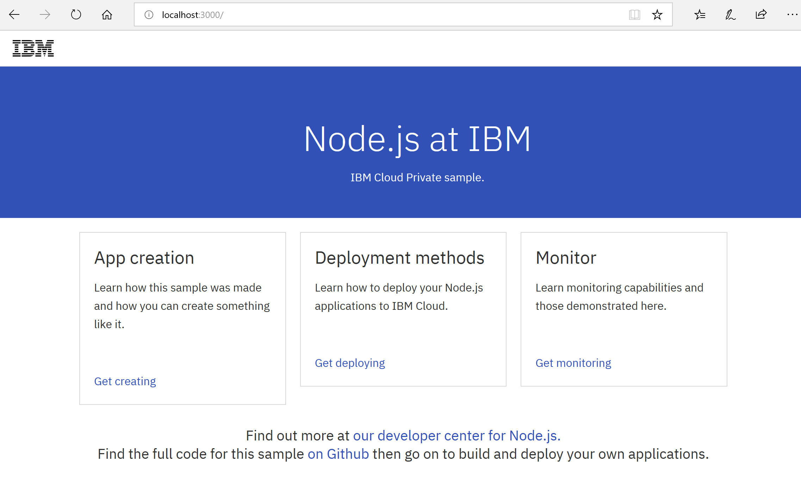

# 2. Making Node.js apps with Docker
First, we will go over the icp-node-js-sample app and Dockerfile. Then, we will see Dockerfile best practices for nodejs using the basic hello world app from the Node.js site.

### Node.js Download for Later
Here is the [Node.js download](https://nodejs.org/en/) if you want to run it locally to familiarize yourself with it/develop with it. For this guide, you actually don't need Node.js installed on your computer because of the magic of Docker 

## If Using a Proxy
If using a proxy, make sure you've read [0-ProxyPSA](0-ProxyPSA.md) and have set your `http_proxy`, `https_proxy`, and `no_proxy` variables for your environment as specified there. Additionally, note that for all docker run commands add the -e for each of the proxy environment variables as specified in that 0-ProxyPSA document.

## ICP Node.js Sample
From the main directory for this `MultiArchDockerICP` guide, go into `icp-nodejs-sample` directory. Here, open up the `Dockerfile`. The code for this project comes from [ibm-cloud-private-nodejs-sample](https://github.com/ibm-developer/icp-nodejs-sample). Let's see what we got here folks.

Run it with `docker run --rm -it -p 3000:3000 gmoney23/nodejs-sample` and go to `localhost:3000` in web browser to see it. If on server instead of desktop go to `http://serverip:3000` where serverip is your server's ip address

Here is what it will look like in the browser 

Quit the app by hitting both the control and c keys (ctrl c) in the terminal/ command prompt / PowerShell

## Node.js Hello World Server
From the main directory for this `MultiArchDockerICP` guide go into `node-web-app` directory. Here, open up the `Dockerfile` and see comments for how to write best practice Node.js Dockerfile. The simple code we're dockerizing for the web app comes from this [Node.js guide](https://nodejs.org/en/docs/guides/nodejs-docker-webapp/)

Run it with `docker run --rm -it -p 3000:8080 gmoney23/node-web-app` and go to `localhost:3000` in web browser to see it. If you're on a server instead of desktop go to `http://serverip:3000` where serverip is your server's ip address

Here is what it will look like in the browser 

Here's what it will look like in the cli 

Quit the app by hitting both the control and c keys (ctrl c) in the terminal/ command prompt / PowerShell

The above Dockerfile can be used as a template for creating best-practice nodejs Docker images in the future. For further help in crafting the best docker images possible for Node.js see [Node.js Docker Best Practices](https://github.com/nodejs/docker-node/blob/master/docs/BestPractices.md).

# [Part 3: Time to get go-ing](3-Best-Practice-go.md)
