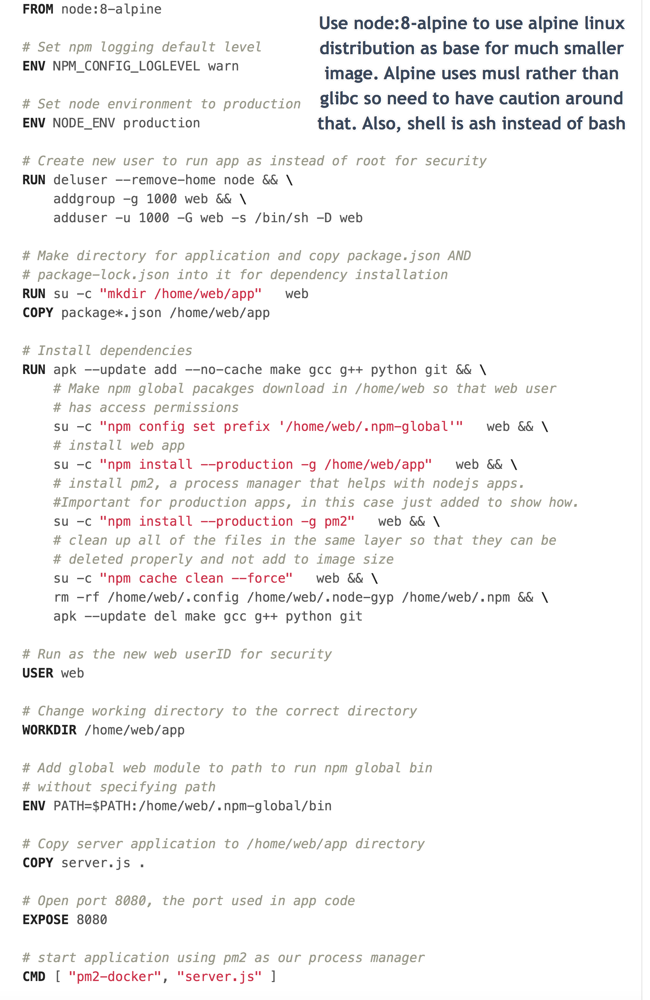

# 2. Learning How to Build Best-practice Node.js Docker Images
First, we will go over the icp-node-js-sample app and Dockerfile. Then, we will see Dockerfile best practices for nodejs using the basic hello world app from the Node.js site.

*Note: We will build all of these images in Part 4. This is a guide explaining the ins and outs of making the files to do so [i.e. the foundation for success]*

### Node.js Download for Later
Here is the [Node.js download](https://nodejs.org/en/) if you want to run it locally to familiarize yourself with it/develop with it. For this guide, you actually don't need Node.js installed on your computer because of the magic of Docker. 


## If Using a Proxy
If using a proxy, make sure you've read [0-ProxyPSA](0-ProxyPSA.md) and have set your `http_proxy`, `https_proxy`, and `no_proxy` variables for your environment as specified there. Additionally, note that for all docker run commands add the `-e` for each of the proxy environment variables as specified in that 0-ProxyPSA document.


## ICP Node.js Sample
Here is the Dockerfile for the [ICP Node.js Sample](https://github.com/siler23/MultiArchDockerICP/blob/master/icp-nodejs-sample/Dockerfile). Let's see what we got here folks:


Run it with: 

```
docker run --rm -it -p 3000:3000 gmoney23/nodejs-sample
```

Click on <a href="http://localhost:3000/" target="_blank" rel="noopener" rel="noreferrer">nodejs-sample</a> (while it's running) to see it in your web browser.

If on a server instead of a desktop go to `http://serverip:3000` where serverip is your server's ip address.

Here is what it will look like in the browser:


**Quit the app by hitting both the control and c keys (ctrl c) in the terminal/ command prompt / PowerShell**

## Why Should I Optimize my Nodejs Images?

### Security

Running the container as root can potentially leave open security vulnerabilities which can be curtailed by running the container as a regular user. We will see how to do this in the example below.

Additionally, smaller base images such as the alpine image below have a smaller attack surface in terms of vulnerable software (more software / packages = more potential vulnerabilities) and thus, regularly perform magnitudes better (have many times less vulnerabilities) in container security scans than base images of more traditional operating systems such as Ubuntu.

### Size

By minimizing the size of images, we can prevent wasting resources for large base images and prevent using a ton of storage for all of our container images. Moreover, we can take better advantage of cache for our running containers.

## Node.js Hello World Server

Here is the [node-web-app Dockerfile](https://github.com/siler23/MultiArchDockerICP/blob/master/node-web-app/Dockerfile) where we can see comments for how to write a best practice Node.js Dockerfile. The simple code we're dockerizing for the web app comes from this [Node.js guide](https://nodejs.org/en/docs/guides/nodejs-docker-webapp/)



Run it with:

```
docker run --rm -it -p 8080:8080 gmoney23/node-web-app
```

Click on <a href="http://localhost:8080/" target="_blank" rel="noopener" rel="noreferrer">node-web-app</a> (while it's running) to see it in your web browser.

If you're on a server instead of a desktop go to `http://serverip:8080` where serverip is your server's ip address.

Here is what it will look like in the browser:


**Quit the app by hitting both the control and c keys (ctrl c) in the terminal/ command prompt / PowerShell.**

Here's what it will look like in the cli, once you've quit


The above Dockerfile can be used as a template for creating best-practice nodejs Docker images in the future. For further help in crafting the best docker images possible for Node.js see [Node.js Docker Best Practices](https://github.com/nodejs/docker-node/blob/master/docs/BestPractices.md).

Knowing that it's **Time to get go-ing** fills you with [determination](https://undertale.fandom.com/wiki/Determination).
# [Part 3: Guide to Building Best-practice Go Docker Images](3-Best-Practice-go.md)
