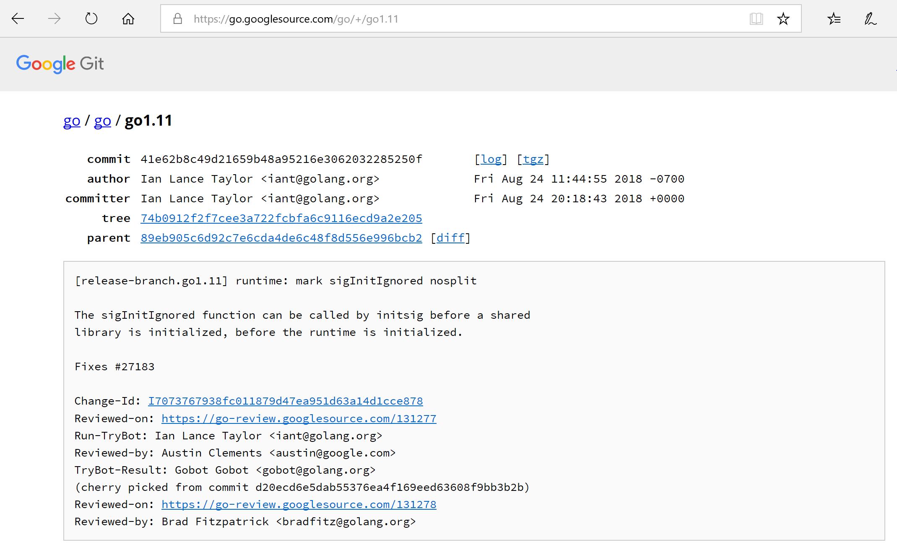
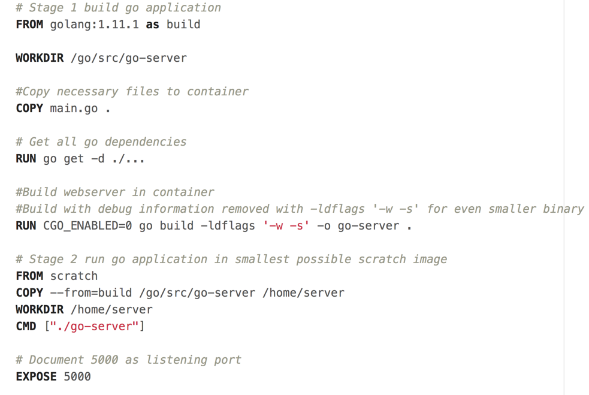
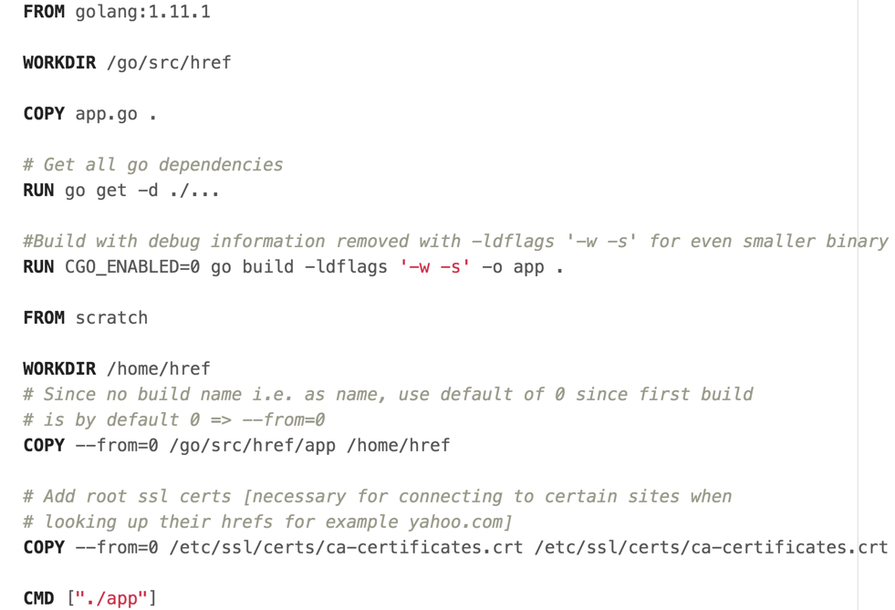

# 3. Making go apps with Docker
We will go over three apps and show how to optimize our go code for docker
1. Go example Outyet program
2. Go Hello world
3. Go href-counter

### But first...Download go for later
Here is the [Go download](https://golang.org/dl/) if you want to run it locally to familiarize yourslef with it/develop with it. For this section, you actually don't need golang installed on your computer because of the magic of docker.

## If Using Proxy
If using proxy, make sure you've read [0-ProxyPSA](0-ProxyPSA.md) and have set your `http_proxy`, `https_proxy`, and `no_proxy` variables for your environment as specified there. Also note that for all docker run commands add the -e for each of the proxy environment variables as specified in that 0-ProxyPSA document.

## Outyet
Outyet is a go example program from [Go Outyet Example](https://github.com/golang/example/tree/master/outyet). This app checks if the version of Go specified (in our case 1.11 is out yet). Since we are using it, it better be! We will be dockerizing this app, shrinking our image down on the way over 3 iterations.
### Iteration 1: Outyet
In this first iteration we make the go app in a container and get it running. Since there is a large base image needed for compiling the application and a large os is used for that image, this will be a rather large container. From folder `MultiArchDockerICP` go to outyet and open its Dockerfile. Read the comments for details about the Dockerfile.


Run it with `docker run --rm -it -p 3000:8080 gmoney23/outyet` and go to `localhost:3000` in web browser to see it.

Here's what it will look like in the browser 

Here's the git page for go 1.11 when you click YES 

Quit the app by hitting both the control and c keys (ctrl c) in the terminal/ command prompt / PowerShell.

To check it's size I ran `docker images gmoney23/outyet`
and get a whopping 786 Mb, no room for dessert :(

```
gmoney23/outyet     latest              1bfff6d47511        4 days ago          ***786MB***
```

*Seeing the room for improvement fills us with determination ...*

### Iteration 2: Small-outyet
In this second iteration, we attempt to improve upon our original endeavor using multi-stage builds. What is a multi-stage build? A build that happens in multiple stages. Mic drop...[docker multi-stage build](https://docs.docker.com/develop/develop-images/multistage-build/) What, we can do with this is build the golang application in a container with all the bells and whistles and then copy it to another container that is much smaller where we just run it. This works so well, since by turning CGO_ENABLED=0 everything is statically compiled. In this case, we're going to copy it into the Alpine base image which should cut down its size considerably.


Run it with `docker run --rm -it -p 3000:8080 gmoney23/small-outyet` and go to `localhost:3000` in web browser to see it.

*Note: The  web page looks the same as for outyet since it's the same app so I've omitted images here.*

Quit the app by hitting both the control and c keys (ctrl c) in the terminal/ command prompt / PowerShell.

To check it's size I ran `docker images gmoney23/small-outyet`

```
gmoney23/small-outyet   latest              aa8b746dc754        4 days ago          ***13.9MB***
```

From 786MB -> 13.9MB that's some serious shrinkage.

*The amount the container has shrunk fills us with determination...*

## Iteration 3: Smallest-Outyet
How do we get smaller than starting with a 5MB alpine image? How about start with nothing. We are going to use the special [scratch image](https://hub.docker.com/_/scratch/) which starts fresh. Since everything can be set to statically compile in go with CGO_ENABLED=0, we can just package the binary in a container without even a shell. This lessons attack surface area and gives us a super light image. On top of that, we'll add some compiler flags for production to cut off the debug info space in go. Here's how it all looks in the smallest-outyet directory's Dockerfile.


Run it with `docker run --rm -it -p 3000:8080 gmoney23/smallest-outyet` and go to `localhost:3000` in web browser to see it.

*Note: The  web page looks the same as for outyet since it's the same app so I've omitted images here.*

Quit the app by hitting both the control and c keys (ctrl c) in the terminal/ command prompt / PowerShell

To check it's size I ran `docker images gmoney23/smallest-outyet`

```
gmoney23/smallest-outyet   latest              5a46896a4b2c        4 days ago          ***6.89MB***
```

***From 13.9MB -> 6.89MB for a grand transformation of 786MB -> 6.89MB, a little over 114X smaller than the original image! That's a lot of room for dessert :)***
## Go Hello world
Using the techniques we just employed, let's so how small of a docker image we can make for a [basic go hello world app](https://gist.github.com/enricofoltran/10b4a980cd07cb02836f70a4ab3e72d7) from gist.
In the example-go-server directory of the MultiArchDockerICP project we find the following Dockerfile I made.



Run it with `docker run --rm -it -p 3000:5000 gmoney23/example-go-server` and go to `localhost:3000` in web browser to see it.

Here is what it will look like in the browser 

Here's what it will look like in the cli 

Quit the app by hitting both the control and c keys (ctrl c) in the terminal/ command prompt / PowerShell

To check its size I ran `docker images gmoney23/example-go-server`

```
gmoney23/example-go-server   latest              a4907d7afdda        4 days ago          4.9MB
```

This gives us an image of 4.9MB, quite astounding!

## Href-Counter
Finally, lets dockerize an app that prints output for us instead of a web app. [Href-counter](https://github.com/alexellis/href-counter) is an application that counts the number of internal and external-hrefs on a web-page to rate SEO. It is referenced in the multi-stage build manual for docker we looked at [before](https://docs.docker.com/develop/develop-images/multistage-build/) and fits the bill for us. Let's look at its Dockerfile at href-counter inside of MultiArchDockerICP.


We can try the tool out against different sites using `docker run --rm -e url=http://blog.alexellis.io/ gmoney23/href`

```
{"internal":51,"external":2}
```

**Note: For PROXY**: add your -e for http_proxy, etc.:

`docker run --rm -e http_proxy=%http_proxy% -e https_proxy=%https_proxy% -e no_proxy="%no_proxy%" -e url=http://google.com href`

**More Examples**

`docker run --rm -e url=http://yahoo.com gmoney23/href`

```
{"internal":16,"external":74}
```

`docker run --rm -e url=http://honolulu.gov gmoney23/href`

```
{"internal":78,"external":31}
```

You'll be pleased to know our Dockerfile made this image small as well. We can see with `docker images gmoney23/href`

```
REPOSITORY          TAG                 IMAGE ID            CREATED             SIZE
gmoney23/href       latest              df5ad8db9a46        4 days ago          ***5MB***
```

For more go best practices and tips with docker see this [excellent article](https://blog.docker.com/2016/09/docker-golang/)

# [Part 4: Time to build some images!](4-Build-MultiArch.md)
