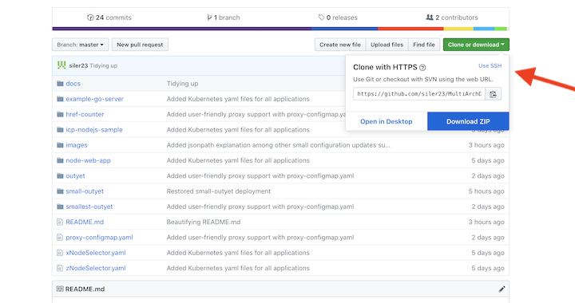

# From Docker to Kubernetes - Multi-Arch with Go and Nodejs

This guide has 5 main parts:

1. [Getting Official with Multi-arch Images](1-Official-Multiarch.md)
2. [Learning How to Build Best-practice Node.js Docker Images](2-Best-Practice-Nodejs.md)
3. [Guide to Building Best-practice Go Docker Images](3-Best-Practice-go.md)
4. [Building Multi-arch Docker Images](4-Build-MultiArch.md)
5. [Kubernetes Time](5-Deploy-to-Kubernetes.md)

Proxy Users here is your extra part to start with:

[Hello Proxy Users](0-ProxyPSA.md)

!!! Tip "Who is a proxy user?"

    A proxy user is an individual connecting to the internet via a [proxy server](https://www.varonis.com/blog/what-is-a-proxy-server/){target=_blank}. This setup is done for network security in enterprise environments and requires setting proxy variables such as `http_proxy`, etc. If you are behind a proxy server, you would most likely know about it due to the need to change settings to get various applications to work. Therefore, if you don't think you are using a proxy, you most likely are not. However, if you are really unsure about this, [this article](https://helpdeskgeek.com/networking/internet-connection-problem-proxy-settings/){target=_blank} can help you find out for certain.

## Prerequisites

* Have an up and running Kubernetes cluster

* Setup access to that cluster using kubectl

* Register for a DockerHub account following the process outlined on [DockerHub here](https://success.docker.com/article/how-do-you-register-for-a-docker-id){target=_blank}

* Download Docker on your workstation from DockerHub using your newly created free account [here](https://hub.docker.com/?overlay=onboarding){target=_blank}

## What will this Guide do for you?

This guide will start by looking at what Official Repositories are and how to build from them. Then, it will shine light on how to tell if an app will run on your platform (architecture). Next, we will look at how best to build images for go and nodejs in Docker with examples and then actually build these images with Multi-Architecture manifests. Finally, we will use these images or my pre-built images to deploy to a Kubernetes cluster.

## What in the Tarnation is a Container?

Application containers make use of linux kernel features to provide lightweight isolation by limiting what a process (running program) can see ([namespaces](http://man7.org/linux/man-pages/man7/namespaces.7.html){target=_blank}), what system resources a process can use ([cgroups](http://man7.org/linux/man-pages/man7/cgroups.7.html){target=_blank}), and what system calls a process can make ([seccomp](http://man7.org/linux/man-pages/man2/seccomp.2.html){target=_blank}) combined with other features such as enhanced access control ([SELinux](https://selinuxproject.org/page/Main_Page){target=_blank}). We use [container images](https://www.docker.com/resources/what-container){target=_blank} (all the dependencies and files our application needs to run put together in layers), which we can bundle and store in image repositories to use to start containers (run a process using the files from the aforementioned container image (image) tar file in an environment with the isolation described above).

If you just finished reading the above and want to get a little deeper into some of the parts of containers I just name-dropped please have a look see at [What even is a container: namespaces and cgroups](https://jvns.ca/blog/2016/10/10/what-even-is-a-container/){target=_blank}.

If you want a technical deep-dive into containers and container runtimes getting into the nitty-gritty, the fabulous 4 part series [Container Runtimes](https://www.ianlewis.org/en/container-runtimes-part-1-introduction-container-r){target=_blank} is the happy path for you.

## Get the Code

The code for this guide is on the [accompanying GitHub](https://github.com/siler23/MultiArchDockerKubernetes){target=_blank}. You can also access this page by clicking on the GitHub icon on the top right of every page.


If you have git installed, it can be brought onto your computer with:

``` bash
git clone https://github.com/siler23/MultiArchDockerKubernetes.git
```

If you don't have git or don't want to clone this repo, you can use the download link in the top right corner of the GitHub page.



## Search to your Heart's Content

Search the docs for the content you want by using the search bar at the top of each page like so for hello world.


!!! tip
    You can also immediately jump to the search bar by typing `f` or `s`.

## Let's Begin

**Non-Proxy Users** (Regular Users) Start Here:
[Official Docker Repos and Multi-Arch Primer](1-Official-Multiarch.md)

**Proxy Users** Start Here:
[Proxy PSA for Proxy Users](0-ProxyPSA.md)

## Places to go and things to see in the Future

### Possible Next Steps

* [Packaging Applications and Services with Kubernetes Operators](https://developers.redhat.com/topics/kubernetes/operators){target=_blank}

* [Red Hat OpenShift Free Interactive Online Learning](https://learn.openshift.com){target=_blank}

### IBM Guidance on Containers on IBM Z

* [IBM Guidance on running Docker containers on IBM Z PDF](http://public.dhe.ibm.com/software/dw/linux390/docu/l177vd00.pdf){target=_blank}

## Shout-out to Mkdocs

I made this site with [mkdocs](https://www.mkdocs.org){target=_blank} using the [material](https://squidfunk.github.io/mkdocs-material/){target=_blank} theme.
